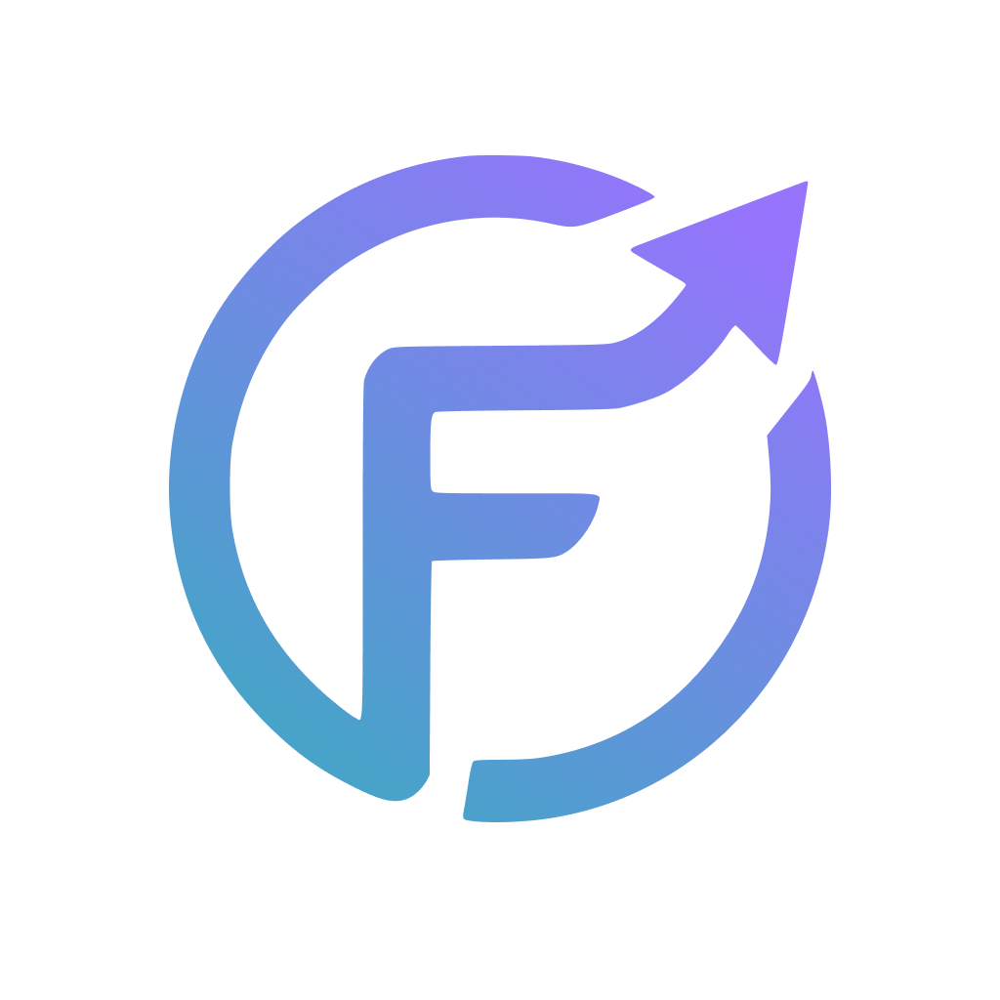

<div align="center">
    
    <h1 align="center">Fundyze</h1>
    <p align="center">
        Fundyze is an intelligent platform that helps analyze emerging companies, evaluate their potential, and identify promising investment opportunities.
    </p>
</div>

## 🚀 Quick Start

### Prerequisites

- [Docker](https://www.docker.com/get-started) and Docker Compose installed on your machine

### Running the Project

1. **Clone the repository**

   ```bash
   git clone https://github.com/Fundyze/fundyze.git
   cd fundyze
   ```

2. **Set up environment variables**

   ```bash
   cp .env.example .env
   # Edit .env with your configuration if needed
   ```

3. **Start the application**

   ```bash
   docker-compose up
   ```

4. **Access the application**
   - Frontend: [http://localhost:3000](http://localhost:3000)
   - Backend API: [http://localhost:8000](http://localhost:8000)

That's it! The application is now running with hot-reload enabled for development.

For more detailed Docker instructions, see [README.docker.md](./README.docker.md).
